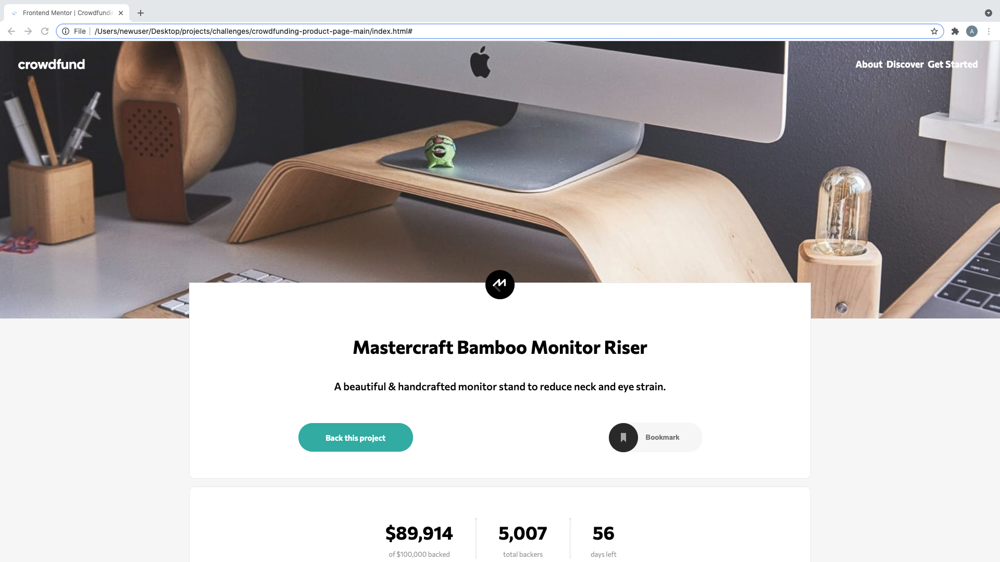

# Frontend Mentor - Crowdfunding product page solution

This is a solution to the [Crowdfunding product page challenge on Frontend Mentor](https://www.frontendmentor.io/challenges/crowdfunding-product-page-7uvcZe7ZR). Frontend Mentor challenges help you improve your coding skills by building realistic projects.

## Table of contents

-   [Overview](#overview)
    -   [The challenge](#the-challenge)
    -   [Screenshot](#screenshot)
    -   [Links](#links)
-   [My process](#my-process)
    -   [Built with](#built-with)
    -   [What I learned](#what-i-learned)
    -   [Continued development](#continued-development)
    -   [Useful resources](#useful-resources)
-   [Author](#author)
-   [Acknowledgments](#acknowledgments)

## Overview

### The challenge

Users should be able to:

-   View the optimal layout depending on their device's screen size
-   See hover states for interactive elements
-   Make a selection of which pledge to make
-   See an updated progress bar and total money raised based on their pledge total after confirming a pledge
-   See the number of total backers increment by one after confirming a pledge
-   Toggle whether or not the product is bookmarked

### Screenshot

### Links

-   Solution URL: [Check out the code!](https://github.com/axseinga/crowdfunding-product-page-main)
-   Live Site URL: [Check out live site here!](https://axseinga-crowdfunding-page.netlify.app/)

## My process

### Built with

-   Semantic HTML5 markup
-   CSS custom properties
-   SASS
-   Flexbox
-   CSS Grid
-   Mobile-first workflow
-   BEM patterns
-   vanilla JS

### What I learned

This project took me very long time as I was coming back and forth to it many times. After I finished most of styling I got focused on practising pure JS doing other projects and exercises. So in the end my code it looks like nice spaghetti code but I am pround I finally finished it as it feels like forever comparing to other projects from Frondend Mentor.

The most challenging parts were... oh everything here was challenging a bit. If you think about it as sigle components it might be easy to code but in the end it was really hard to make it all work together.

I learned more about radio buttons and how to use JS to manipulate them, I used forEach loop on radio buttons to achieve that. During this challenge I read a lot about CSS/JS animations and saw many different approaches. I found out it is priceless to be able to get help from other people who code as sometimes you can read so much and coudn't really be able to find the best solution and get lost. And here big credit goes to [tediko](https://www.frontendmentor.io/profile/tediko) for helping me out with animations. Thanks to him I had a chance to learn about [focus-trap](https://uxdesign.cc/how-to-trap-focus-inside-modal-to-make-it-ada-compliant-6a50f9a70700) as well.

This challenge was perfect to learn more about plain Javascript. The page might look simple but it actually required a lot of functions to control the behavior of modals and overlay.

### Continued development

During working on this project I found out that @import in SASS is an outdated practise already and I should use @use and @forward so in my next project I am definitely going to use it! [1](https://dev.to/ibreakcodes/use-forward-in-sass-2bab)[2](https://www.youtube.com/watch?v=CR-a8upNjJ0)

### Useful resources

-   [Stackoverflow: Scroll to top](https://stackoverflow.com/questions/1144805/scroll-to-the-top-of-the-page-using-javascript) - This thread helped me to figure out how to code a function which takes User to the top of the page. Without that the page was hard to navigate.
-   [Stackoverflow: How can I parse a string with a comma thousand separator to a number?](https://stackoverflow.com/questions/11665884/how-can-i-parse-a-string-with-a-comma-thousand-separator-to-a-number) - This thread help me find easy solution to convert total money backed to a number so I can calculate new total after User contributes to it.
-   [Animating from “display: block” to “display: none”](https://www.impressivewebs.com/animate-display-block-none/) - and why it is not possible easy way. It is good to read comments as well!
-   [Focus-trap](https://uxdesign.cc/how-to-trap-focus-inside-modal-to-make-it-ada-compliant-6a50f9a70700)

## Author

-   Github - [Axseinga](https://github.com/axseinga)
-   Frontend Mentor - [@Axseinga](https://www.frontendmentor.io/profile/axseinga)
-   LinkedIn - [@Agnieszka Urbanowicz](https://www.linkedin.com/in/agnieszka-urbanowicz-051147151/)

## Acknowledgments

Credits to [tediko](https://www.frontendmentor.io/profile/tediko) one more time!
